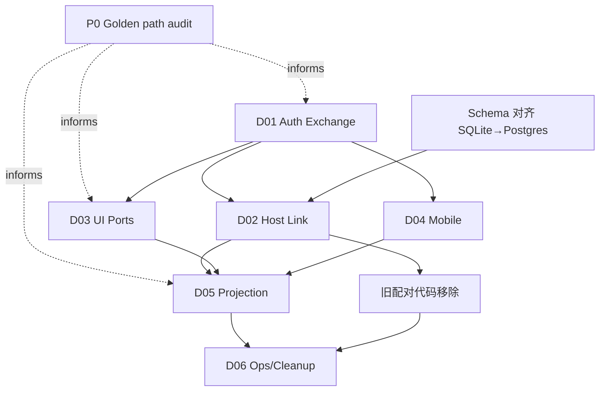

# Program: Cloud Identity · Host Link · Multi-Client Surfaces

| Field | Value |
|-------|--------|
| Status | Active (L1 fleshed 2026-07-31) |
| Date | 2026-07-30 |
| L0 north star | [../2026-07-30-cloud-identity-clients-long-term.md](../2026-07-30-cloud-identity-clients-long-term.md) |
| Task graph | [tasks/TASKS.md](tasks/TASKS.md) |
| First milestone | **Desktop ↔ Mobile 联通**（Phase 0→1→4→3） |

This folder is the execution map: L1 domain designs, L2 tasks, dependency edges.
Product direction and non-goals live in L0; do not fork strategy here.

## Document layers

| Layer | What | Where |
|-------|------|-------|
| L0 | Why, roles, phase intent, success criteria | long-term spec |
| L1 | Per-domain contracts, data, UX, open questions | 01–06 |
| L2 | Executable tasks with depends_on / exit criteria | tasks/TASKS.md |

L0 → L1 (this dir) → L2 (tasks DAG)

## L1 domain index

| ID | Document | Status | Owns | Primary consumers |
|----|----------|--------|------|-------------------|
| D01 | [01-auth-exchange](01-auth-exchange.md) | **Implementation-ready** | Supabase IdP → Minos JWT exchange, account bind/merge | Backend, all clients |
| D02 | [02-host-link](02-host-link.md) | **Implementation-ready** | Same-account host binding; QR 結対移除 | Daemon, Desktop, macOS, Backend |
| D03 | [03-client-ports-ui](03-client-ports-ui.md) | **Implementation-ready** | Shared React UI (workspace alias); HostPort vs CloudPort | Desktop, Web |
| D04 | [04-mobile-cloud-path](04-mobile-cloud-path.md) Refined | Mobile golden path + cloud semantics; QR 移除 | Mobile |
| D05 | [05-projection-sync](05-projection-sync.md) | Refined | Host → cloud projection → remote visibility | Daemon, Backend, all viewers |
| D06 | [06-ops-config](06-ops-config.md) | Refined | Secrets, env, schema 对齐, 旧代码移除, config origin | Ops, CI |

## Program DAG (domain-level)



## Phase mapping (L0 ↔ this tree)

| L0 Phase | Domains | First milestone? |
|----------|---------|------------------|
| Phase 0: Golden path | P0 | ✅ |
| Phase 1: Schema + auth exchange | D01, SCHEMA | ✅ |
| Phase 2: Web design system | D03 | (parallel, not first milestone) |
| Phase 3: Mobile auth | D04 | ✅ |
| Phase 4: Desktop + Host link | D02, CLEANUP | ✅ |
| Phase 5: Projection | D05 | ✅ |
| Phase 6: Hardening | D06 | (after milestone) |
| Phase 7: Verification | cross-cutting | (after milestone) |

## First milestone: Desktop ↔ Mobile 联通

第一个里程碑聚焦 **Desktop + Mobile 两端**（不含 Web timeline）。三端 E2E（`T-proj-03`）是后续扩展。

关键路径（依赖顺序）：

```text
T-p0-* (golden path audit)
  → T-schema-01 → T-schema-02 (SQLite→Postgres 对齐 + store 迁移)
  → T-auth-01..04 (Supabase exchange endpoint)
  → T-auth-08 (Desktop system browser OAuth)
  → T-ui-06 (Desktop account chrome)
  → T-host-01..04 (Host Link API + daemon RPC + Desktop UX)
  → T-mob-01..04 (Mobile exchange + hosts + stream)
  → Desktop + Mobile E2E 验证
```

**第二里程碑（扩展）**：Web CloudPort（`T-ui-01..05`）→ 三端 E2E（`T-proj-03`）。

并行任务（不阻塞第一里程碑关键路径）：
- `T-ui-01..05`（Web CloudPort，第二里程碑）
- `T-cleanup-*`（旧代码移除，在 Host Link 上线后）
- `T-proj-01`（gap audit，可随时开始）

## How to work

1. Change direction → edit L0, adjust L1 + TASKS edges
2. Change domain contract → edit L1 doc; add/split L2 tasks; update depends_on
3. Implementation → pick task with all depends_on=done, open PR, update status
4. Prefer one L1 or vertical slice per PR; never invent second IdP or dual business DB

## Status legend (tasks)

`pending` | `ready` | `active` | `blocked` | `done` | `cancelled`
