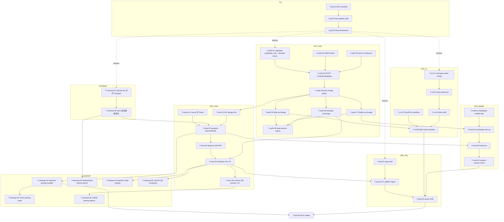

# L2 Task Graph

Machine-oriented task list for the [program](../README.md).  
Update `status` when work moves. Do not start a task until every `depends_on` is `done` (or explicitly waived).

**Status values:** `pending` | `ready` | `active` | `blocked` | `done` | `cancelled`

---

## DAG overview

Solid edges = hard dependency. Dotted = soft (start earlier OK).

---

## P0 · Golden path on current hub

### T-p0-01 · Write E2E checklist
| Field | Value |
|-------|--------|
| status | pending |
| lane | docs / product |
| depends_on | — |
| exit | Checklist covering register/login → pair → host online → session → remote observe |

### T-p0-02 · Execute checklist against prod hub
| Field | Value |
|-------|--------|
| status | pending |
| lane | manual |
| depends_on | T-p0-01 |
| exit | Pass/fail notes for `minos.ainexc.com` with current password + pairing |

### T-p0-03 · File blockers only
| Field | Value |
|-------|--------|
| status | pending |
| lane | eng |
| depends_on | T-p0-02 |
| exit | Each failure linked to a bug task or accepted deferral |

---

## SCHEMA · SQLite/Postgres 对齐

### T-schema-01 · SQLite dev migration 对齐 Postgres 形态
| Field | Value |
|-------|--------|
| status | done |
| lane | backend |
| depends_on | — (soft: T-p0-03) |
| exit | SQLite `devices` → `device_installations`（`kind` enum）；`account_host_pairings` → `host_links`（加 `acl_json`/`link_display_name`）；移除 `secret_hash`；移除 `pairing_codes`；加 CHECK 约束 |

### T-schema-02 · Rust store 层迁移到新表名
| Field | Value |
|-------|--------|
| status | done |
| lane | backend |
| depends_on | T-schema-01 |
| exit | `store::devices` → `store::device_installations`；`store::account_host_pairings` → `store::host_links`；所有 SQL 查询更新；`cargo test` 绿 |

---

## D01 · Auth exchange

### T-auth-01 · Migration `accounts.supabase_sub` + `installation_kind` add `desktop`
| Field | Value |
|-------|--------|
| status | done |
| lane | backend |
| depends_on | — (soft: T-p0-03) |
| exit | Postgres: `accounts.supabase_sub TEXT NULL UNIQUE`；`ALTER TYPE installation_kind ADD VALUE 'desktop'`；CHECK 约束更新；backend boots |

### T-auth-02 · JWKS fetch + verify helper
| Field | Value |
|-------|--------|
| status | pending |
| lane | backend |
| depends_on | — |
| exit | `supabase.rs` 模块；JWKS cache（5min TTL + kid 轮换）；verify_jwt tests: valid/invalid/expired/bad-iss/bad-aud；使用 `jsonwebtoken` crate |

### T-auth-03 · `POST /v1/auth/supabase`
| Field | Value |
|-------|--------|
| status | pending |
| lane | backend |
| depends_on | T-auth-01, T-auth-02, T-auth-05 |
| exit | Exchange endpoint；**不调用** `authenticate()`；直接接受 Supabase JWT + `X-Device-Id`；返回 `AuthResp`（与 login 兼容）；rate limited |

### T-auth-04 · Merge policy + integration tests
| Field | Value |
|-------|--------|
| status | pending |
| lane | backend |
| depends_on | T-auth-03 |
| exit | Tests: new user / existing sub login / verified-email auto-merge / unverified no-merge / merge conflict 409 |

### T-auth-05 · Server env for Supabase issuer/JWKS/aud
| Field | Value |
|-------|--------|
| status | pending |
| lane | backend / ops |
| depends_on | — |
| exit | `SUPABASE_URL`、`SUPABASE_JWT_AUD` in `.env.example` + `deploy/prod/docker-compose.yml`；no secrets in git |

### T-auth-06 · Web: Supabase client + exchange
| Field | Value |
|-------|--------|
| status | pending |
| lane | web |
| depends_on | T-auth-04 |
| exit | `@supabase/supabase-js` → `signInWithOAuth` → exchange → Minos session → authenticated `/v1` call |

### T-auth-07 · Mobile: Supabase + exchange
| Field | Value |
|-------|--------|
| status | done (Phase E) |
| lane | mobile |
| depends_on | T-auth-04 |
| exit | `supabase_flutter` → exchange → Keychain session；cold start resumes |

### T-auth-08 · Desktop: system browser OAuth + deep link
| Field | Value |
|-------|--------|
| status | done (Phase C: email/password + exchange; OAuth/deep-link deferred) |
| lane | desktop |
| depends_on | T-auth-04 |
| exit | 系统浏览器打开 Supabase OAuth → `minos://auth-callback#access_token=...` → exchange → Tauri secure store；account session 可用于 host link |
| notes | Phase C ships Supabase email/password → `/v1/auth/supabase` (or Minos password fallback) + localStorage session. OAuth + `minos://` deep link still open for a follow-up when deep-link plugin is wired. |

### T-auth-09 · Dual-session logout/refresh contract
| Field | Value |
|-------|--------|
| status | pending |
| lane | all clients |
| depends_on | T-auth-06, T-auth-07, T-auth-08 |
| exit | Shared client checklist: refresh uses Minos; logout clears both sides (Minos refresh revoke + Supabase signOut best-effort) |

---

## D03 · Ports + UI

### T-ui-01 · Workspace alias config（packaging locked: Option B）
| Field | Value |
|-------|--------|
| status | pending |
| lane | desktop / web |
| depends_on | — |
| exit | Web `tsconfig.json` paths + `vite.config.ts` alias 配置完成；Web 可以 import `@shared/*` |

### T-ui-02 · Share tokens + primitive UI
| Field | Value |
|-------|--------|
| status | pending |
| lane | desktop / web |
| depends_on | T-ui-01 |
| exit | Desktop `src/shared/{ui,theme,lib,types,presenters}` 整理；Web 构建时使用 Desktop theme tokens |

### T-ui-03 · Define CloudPort TypeScript interface + stub
| Field | Value |
|-------|--------|
| status | pending |
| lane | web |
| depends_on | — |
| exit | `CloudPort` interface + `CloudPortHttp` 实现骨架 checked in |

### T-ui-04 · Web AppShell aligned with Desktop chrome
| Field | Value |
|-------|--------|
| status | pending |
| lane | web |
| depends_on | T-ui-02 |
| exit | Nav shell looks Desktop-family；旧 demo sidebar 移除 |

### T-ui-05 · Web hosts list + one timeline via CloudPort
| Field | Value |
|-------|--------|
| status | pending |
| lane | web |
| depends_on | T-ui-03, T-ui-04, T-auth-06 |
| exit | Authenticated user sees hosts + can open one projected session timeline |

### T-ui-06 · Desktop account chrome (login/logout entry)
| Field | Value |
|-------|--------|
| status | done |
| lane | desktop |
| depends_on | T-auth-08 |
| exit | User can sign in/out from Desktop UI；connection card (Local/Linked) |

### T-ui-07 · Remove dead web demo components
| Field | Value |
|-------|--------|
| status | pending |
| lane | web |
| depends_on | T-ui-05 |
| exit | Unused demo routes/assets deleted |

### T-ui-08 · Presenter purity gate (no tauri in shared)
| Field | Value |
|-------|--------|
| status | pending |
| lane | desktop / web |
| depends_on | T-ui-02 |
| exit | ESLint `no-restricted-imports` rule: `src/shared/**` cannot import `@tauri-apps/*` |

### T-ui-09 · Web settings: origin + account
| Field | Value |
|-------|--------|
| status | pending |
| lane | web |
| depends_on | T-ui-04 |
| exit | Shows backend origin; logout works |

### T-ui-10 · Frontend CI green on program branch
| Field | Value |
|-------|--------|
| status | pending |
| lane | ci |
| depends_on | T-ui-05 |
| exit | `pnpm check` web + desktop on PR |

---

## D02 · Host link

### T-nonce-01 · Bootstrap nonce 迁移 Redis
| Field | Value |
|-------|--------|
| status | done |
| lane | backend |
| depends_on | — |
| exit | `BootstrapNonceStore` 从 DashMap 迁到 Redis（`SET nonce:<value> EX 60` + `GETDEL` consume）；dev 用 Inline Redis；multi-instance safe |

### T-host-01 · Link/unlink API design locked
| Field | Value |
|-------|--------|
| status | done |
| lane | backend |
| depends_on | T-auth-04 |
| exit | OpenAPI/sketch in D02；threat model satisfied；wire shape locked |

### T-host-02 · Backend implement link/unlink/list
| Field | Value |
|-------|--------|
| status | done |
| lane | backend |
| depends_on | T-host-01, T-nonce-01, T-schema-02 |
| exit | `POST /v1/hosts/link` + `POST /v1/hosts/unlink` + `GET /v1/hosts`；tests: link / unlink / multi-host list / host proof / host_linked_elsewhere 409 |

### T-host-03 · Daemon link RPC + persist + ws/host
| Field | Value |
|-------|--------|
| status | done |
| lane | daemon |
| depends_on | T-host-02 |
| exit | `host.prepare_link` / `host.sign_link_proof` / `host.apply_link_token` RPC；daemon 持久化 token；Linked 时连接 `/ws/host` |

### T-host-04 · Desktop "Link this Mac" UX
| Field | Value |
|-------|--------|
| status | done |
| lane | desktop |
| depends_on | T-host-03, T-auth-08, T-ui-06 |
| exit | 登录后一键 Link（调 daemon RPC → backend）；无需 QR；connection card 显示 Linked |

### T-host-05 · Remove QR from Desktop/macOS primary onboarding
| Field | Value |
|-------|--------|
| status | pending |
| lane | desktop / macos |
| depends_on | T-host-04 |
| exit | QR 入口从 onboarding 移除；macOS menu bar 不再显示 QR |

### T-host-06 · Mobile/Web host list uses Linked hosts
| Field | Value |
|-------|--------|
| status | pending |
| lane | mobile / web |
| depends_on | T-host-02, T-ui-05, T-mob-03 |
| exit | Remote clients show linked host presence（`GET /v1/hosts`） |

### T-host-07 · Unlink E2E
| Field | Value |
|-------|--------|
| status | pending |
| lane | manual / tests |
| depends_on | T-host-04 |
| exit | After unlink: remote cannot route；Desktop shows Local only；WS killed |

### T-host-08 · Docs: pairing business-flow update draft
| Field | Value |
|-------|--------|
| status | pending |
| lane | docs |
| depends_on | T-host-05 |
| exit | architecture-business-flow notes host-link primary |

---

## D04 · Mobile

### T-mob-01 · Supabase auth dependency + config
| Field | Value |
|-------|--------|
| status | done (Phase E) |
| lane | mobile |
| depends_on | — |
| exit | `supabase_flutter` added；config slots in `pubspec.yaml` / dart-define |

### T-mob-02 · Exchange + session store
| Field | Value |
|-------|--------|
| status | done (Phase E) |
| lane | mobile |
| depends_on | T-mob-01, T-auth-07 |
| exit | Cold start resumes Minos session；exchange path works；Keychain storage |

### T-mob-03 · Hosts list UI against account pairs
| Field | Value |
|-------|--------|
| status | done (Phase E) |
| lane | mobile |
| depends_on | T-mob-02, T-host-02 |
| exit | `GET /v1/hosts`；shows hosts；empty/offline states clear |

### T-mob-04 · Session stream + send golden path
| Field | Value |
|-------|--------|
| status | done (Phase E: wire existing cloud path + auto-select linked host) |
| lane | mobile |
| depends_on | T-mob-03 |
| exit | Matches T-p0 checklist remote half |

### T-mob-05 · Hide non-golden nav items
| Field | Value |
|-------|--------|
| status | done (Phase F: Sessions / Hosts / 账户 shell; social/projects secondary routes only) |
| lane | mobile |
| depends_on | T-mob-04 |
| exit | Primary nav only golden-path features |

### T-mob-06 · Approval path (if required by P0)
| Field | Value |
|-------|--------|
| status | pending |
| lane | mobile |
| depends_on | T-mob-04, T-proj-02 |
| exit | One approval type works end-to-end or explicitly deferred |

### T-mob-07 · Logout dual-session
| Field | Value |
|-------|--------|
| status | pending |
| lane | mobile |
| depends_on | T-auth-09, T-mob-02 |
| exit | No residual API access after logout |

### T-mob-08 · Mobile analyze/tests for auth session
| Field | Value |
|-------|--------|
| status | pending |
| lane | mobile |
| depends_on | T-mob-02 |
| exit | CI dart lane green for touched code |

---

## D05 · Projection

### T-proj-01 · Gap audit document
| Field | Value |
|-------|--------|
| status | pending |
| lane | daemon / backend |
| depends_on | — (soft: T-p0-03) |
| exit | Markdown table: local action → cloud path → gap Y/N |

### T-proj-02 · Fix golden-path ingest/fanout gaps
| Field | Value |
|-------|--------|
| status | pending |
| lane | daemon / backend |
| depends_on | T-proj-01, T-host-04, T-schema-02 |
| exit | Start/stream/send/stop projected for Linked host；ingest peer target lookup 使用 `host_links` |

### T-proj-03 · Three-client viewer E2E
| Field | Value |
|-------|--------|
| status | pending |
| lane | manual |
| depends_on | T-proj-02, T-ui-05, T-mob-04 |
| exit | Desktop + Web + Mobile observe same session |

### T-proj-04 · Local-only honesty UX Desktop
| Field | Value |
|-------|--------|
| status | pending |
| lane | desktop |
| depends_on | T-host-04 |
| exit | Badge/copy when not cloud-visible |

### T-proj-05 · Offline host empty states Web/Mobile
| Field | Value |
|-------|--------|
| status | pending |
| lane | web / mobile |
| depends_on | T-host-06 |
| exit | Clear offline messaging |

### T-proj-06 · Regression test for projection invariant
| Field | Value |
|-------|--------|
| status | pending |
| lane | backend |
| depends_on | T-proj-02 |
| exit | Automated test would fail if fanout broken |

### T-proj-07 · Job/schema WARN triage
| Field | Value |
|-------|--------|
| status | pending |
| lane | backend |
| depends_on | T-schema-02 |
| exit | Legacy enum/relation WARNs fixed or ticketed |

### T-proj-08 · Multi-host routing smoke
| Field | Value |
|-------|--------|
| status | pending |
| lane | manual |
| depends_on | T-host-04 |
| exit | Two hosts: commands hit intended host |

### T-proj-09 · Subagent projection policy decision
| Field | Value |
|-------|--------|
| status | pending |
| lane | product |
| depends_on | T-proj-01 |
| exit | Written: full tree vs collapse for Mobile v1 |

---

## CLEANUP · 旧配对代码移除（latest-only）

### T-cleanup-01 · Backend pairing module 移除
| Field | Value |
|-------|--------|
| status | pending |
| lane | backend |
| depends_on | T-host-02 |
| exit | `crates/minos-backend/src/pairing/` 删除；`http/v1/pairing.rs` 删除；ROUTE_INVENTORY 移除 6 个旧路由；`pairing_codes` 表从 migration 移除 |

### T-cleanup-02 · `minos-pairing` crate 删除
| Field | Value |
|-------|--------|
| status | pending |
| lane | backend |
| depends_on | T-cleanup-01 |
| exit | `crates/minos-pairing/` 删除；workspace Cargo.toml 移除；`minos-mobile`/`minos-ffi-uniffi`/`minos-daemon` 移除依赖 |

### T-cleanup-03 · `authenticate()` device-secret 轨道移除
| Field | Value |
|-------|--------|
| status | pending |
| lane | backend |
| depends_on | T-schema-02 |
| exit | `http/auth.rs::authenticate()` 删除；`/v1/auth/register`、`/v1/auth/login` 改为不要求 device-secret（或移除，如果 password 完全被 exchange 替代） |

### T-cleanup-04 · Daemon relay pairing 代码移除
| Field | Value |
|-------|--------|
| status | pending |
| lane | daemon |
| depends_on | T-host-04 |
| exit | `crates/minos-daemon/src/relay_pairing.rs` 删除；daemon CLI `pairing-qr` 子命令移除 |

### T-cleanup-05 · Mobile pairing feature 移除
| Field | Value |
|-------|--------|
| status | pending |
| lane | mobile |
| depends_on | T-host-05 |
| exit | `apps/mobile/lib/features/pairing/` 删除；QR camera 权限移除；FRB bindings 重新生成 |

### T-cleanup-06 · macOS QR rendering 移除
| Field | Value |
|-------|--------|
| status | pending |
| lane | macos |
| depends_on | T-host-04 |
| exit | macOS app QR 渲染代码移除；状态栏从 daemon 读取 link 状态 |

---

## D06 · Ops

### T-ops-01 · Supabase + Minos secrets runbook
| Field | Value |
|-------|--------|
| status | pending |
| lane | ops |
| depends_on | T-auth-05 |
| exit | docs/ops entry；rotation steps |

### T-ops-02 · Image publish policy (tags / dispatch)
| Field | Value |
|-------|--------|
| status | pending |
| lane | ci |
| depends_on | — |
| exit | workflow + vps-deploy.md aligned |

### T-ops-03 · VPS update procedure uses pin tags
| Field | Value |
|-------|--------|
| status | pending |
| lane | ops |
| depends_on | T-ops-02 |
| exit | Documented pull/up with sha or backend-v* |

### T-ops-04 · Config origin polish design
| Field | Value |
|-------|--------|
| status | pending |
| lane | all clients |
| depends_on | T-proj-03 |
| exit | Decision: https SSOT + derive wss |

### T-ops-05 · Architecture docs sweep
| Field | Value |
|-------|--------|
| status | pending |
| lane | docs |
| depends_on | T-host-08, T-auth-09, T-proj-03 |
| exit | overview/web/desktop/mobile/business-flow/daemon match program；QR-primary 描述移除 |

### T-ops-06 · Optional disable password registration
| Field | Value |
|-------|--------|
| status | pending |
| lane | backend |
| depends_on | T-auth-06, T-auth-07, T-auth-08 |
| exit | Flag or remove register；documented |

### T-ops-07 · ADR: Supabase exchange + host-link primary
| Field | Value |
|-------|--------|
| status | pending |
| lane | docs |
| depends_on | T-auth-04, T-host-04 |
| exit | ADR accepted under docs/adr/；supersedes ADR 0014 |

---

## Cross-cutting verification

### T-ver-01 · Program success criteria review
| Field | Value |
|-------|--------|
| status | pending |
| lane | product + eng |
| depends_on | T-proj-03, T-host-05, T-auth-09 |
| exit | L0 §8 success criteria all checked |

### T-ver-02 · CI matrix green on main
| Field | Value |
|-------|--------|
| status | pending |
| lane | ci |
| depends_on | T-ver-01 |
| exit | rust/dart/frontend/windows/macos as required |

---

## Suggested execution waves

### Wave 1: Golden path + foundation（Phase 0）
1. `T-p0-01` → `T-p0-02` → `T-p0-03`
2. Parallel: `T-schema-01`（SQLite 对齐）、`T-proj-01`（gap audit）

### Wave 2: Backend exchange + schema（Phase 1）
3. `T-schema-01` → `T-schema-02`（store 层迁移）
4. `T-auth-01` + `T-auth-02` + `T-auth-05`（parallel）→ `T-auth-03` → `T-auth-04`
5. `T-nonce-01`（nonce 迁 Redis，parallel）

### Wave 3: Host Link（Phase 4）— 关键路径
6. `T-host-01` → `T-host-02` → `T-host-03` → `T-host-04`
7. `T-auth-08`（Desktop OAuth）→ `T-ui-06`（Desktop account chrome）（parallel with host-01..03，但 T-ui-06 依赖 T-auth-08 且 T-host-04 依赖 T-ui-06）

### Wave 4: Mobile（Phase 3）
8. `T-mob-01` → `T-mob-02` → `T-mob-03` → `T-mob-04`

### Wave 5: First milestone E2E（Phase 5）
9. `T-proj-02` → `T-proj-03`（三端 viewer E2E）

### Wave 6: Cleanup（Phase 6）
10. `T-cleanup-01..06`（parallel）、`T-host-05`

**Do NOT start `T-host-*` before `T-auth-04` is done.**  
**Do NOT start `T-cleanup-*` before corresponding replacement (`T-host-*`) is done.**
